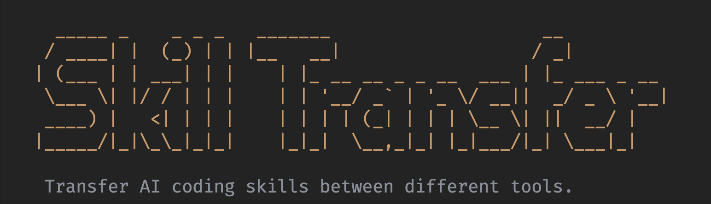

# Skill Transfer CLI




**Skill Transfer CLI** (`st`) is a powerful tool designed to streamline the management and sharing of AI coding skills (workflows, prompts, and configurations) between different environments and tools.

It currently supports **Google Antigravity** (Gemini) adapters, allowing you to easily import workflows into your global user configuration or specific project repositories.

## ✨ Features

- **Interactive TUI**: A beautiful, easy-to-use terminal interface for managing skills.
- **Dual Import Modes**:
  - 🌍 **Global**: Installs skills to your user-level configuration (available across all projects).
  - 📦 **Local**: Installs skills to a specific project's `.agent/workflows` directory.
- **Smart Scanning**: Automatically detects Valid skills (directories containing `SKILL.md`) from your local collection.
- **Auto-Adaptation**: Automatically renames and formats files for the target environment (e.g., converting `SKILL.md` to `<SkillName>.md`).
- **Extensible**: Designed with an adapter pattern to support future tools (Claude Code, Cursor, etc.).

## 📦 Installation

```bash
npm install -g skill-transfer
```

## 🚀 Usage

### Interactive Mode (Recommended)

The easiest way to use the tool is through the interactive menu:

```bash
st interactive
# or simply
st
```

This will launch the TUI where you can:
1. Set/Change your local skill source directory.
2. Browse and select multiple skills (Space to select).
3. Choose the target environment (e.g., Global vs. Local Project).
4. Execute the import with a single keypress.

### CLI Commands

You can also use the CLI directly for automation:

```bash
# Import a skill globally
st import /path/to/my-skill -t antigravity

# Import a skill to a specific project
st import /path/to/my-skill -t antigravity -m local -p /path/to/project
```

#### Options

- `-t, --target <tool>`: Target tool (currently supports `antigravity`).
- `-m, --mode <mode>`: Import mode: `global` (default) or `local`.
- `-p, --project <path>`: Project path (required for `local` mode).

## 📂 Skill Structure

A "Skill" is simply a folder containing a `SKILL.md` file (and optionally other helper files).

**Source Structure:**
```
my-skills/
├── git-commit-helper/
│   ├── SKILL.md      <-- The main workflow definition
│   └── helper.js     <-- Optional helper scripts
└── automated-tests/
    └── SKILL.md
```

**Imported Result (Antigravity):**
When importing `git-commit-helper` globally:
```
~/.gemini/antigravity/global_workflows/git-commit-helper.md
```
*Note: `SKILL.md` is automatically renamed to match the directory name.*

## 🗓️ Roadmap

- [ ] Support for **Claude Code**
- [ ] Support for **Cursor**
- [ ] Support for **Codex**
- [ ] Add more functions

## 🛠 Development

1. **Clone the repository:**
   ```bash
   git clone https://github.com/Gnonymous/Skill-Transfer.git
   cd Skill-Transfer
   ```

2. **Install dependencies:**
   ```bash
   npm install
   ```

3. **Build:**
   ```bash
   npm run build
   ```

4. **Run locally:**
   ```bash
   # Run the built binary
   node dist/bin/skill-transfer.js interactive
   
   # Or using npm script
   npm run dev
   ```

## 📄 License

This project is licensed under the **ISC License**.
